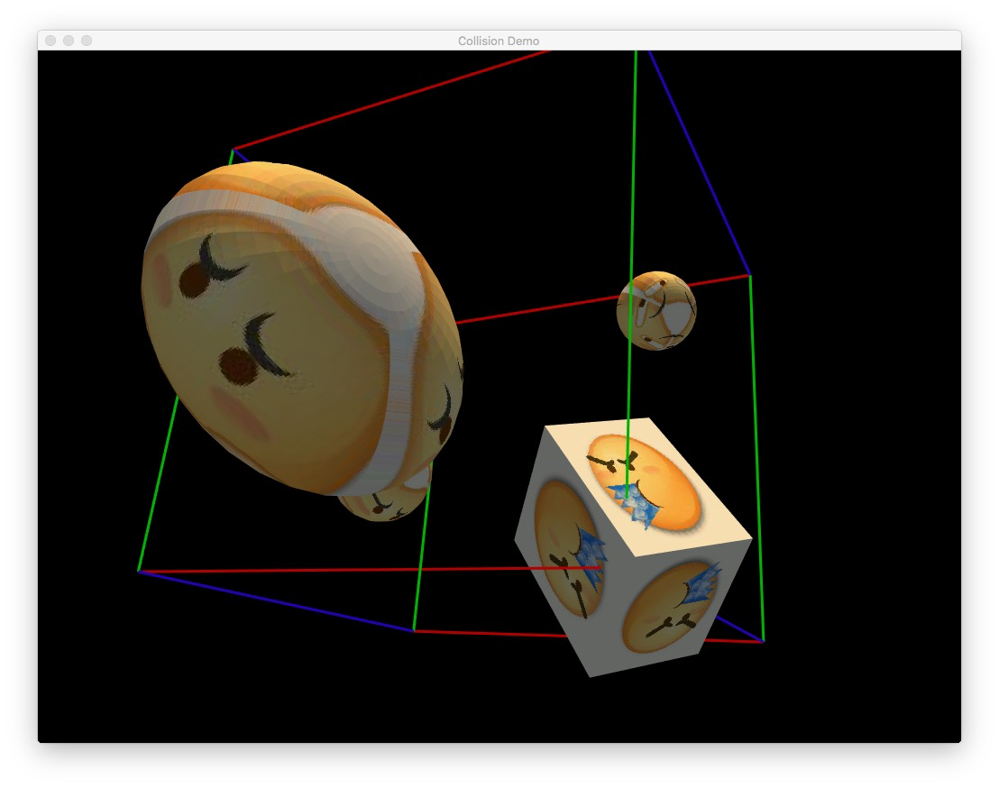
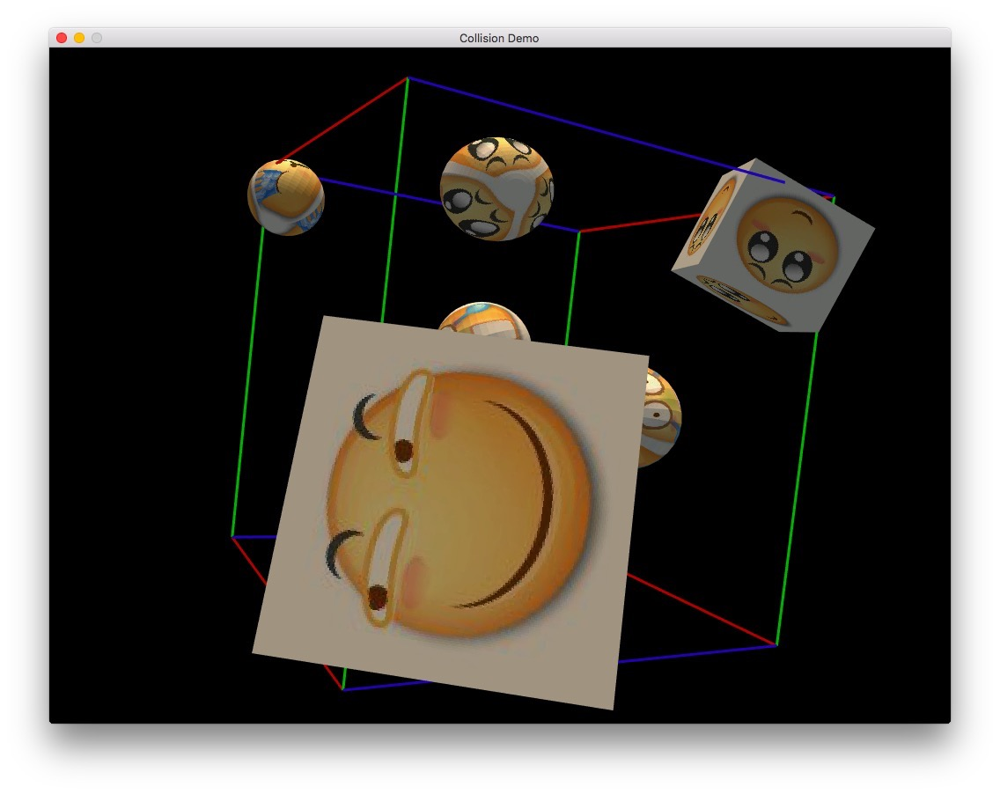
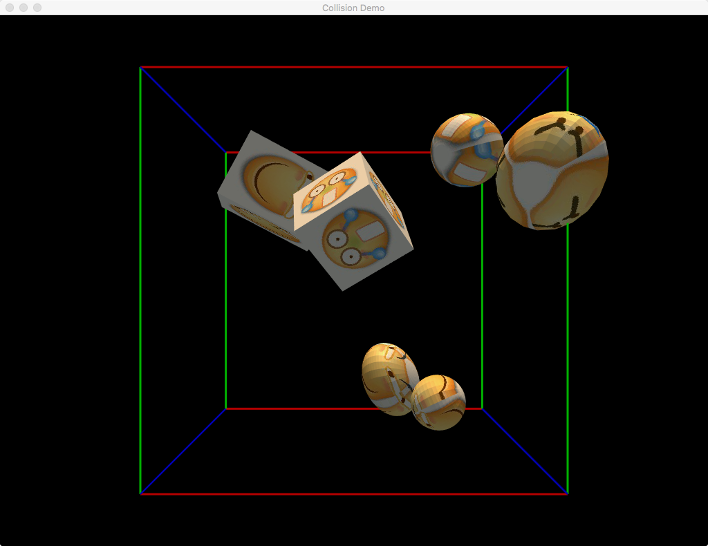

# Project Collision Public

## Introduction

This is the public folder for the project Collision and some other
auxiliary programs. The main program is in the *Collision* folder.

## Features

  1. Collision Simulation  
  2. Sound Effect  
  3. Mouse Event  
	 Wheel---Scroll:  &nbsp;&nbsp;&nbsp;&nbsp;  Scaling  
	 Wheel---Press + Drag:  &nbsp;&nbsp;&nbsp;&nbsp;  Center Rotation  
	 Left Mouse Button---Press + Drag:  &nbsp;&nbsp;&nbsp;&nbsp;  Horizontal Rotation  
	 Right Mouse Button---Press + Drage:  &nbsp;&nbsp;&nbsp;&nbsp;  Translation   
	 Drag Model into the Window:  &nbsp;&nbsp;&nbsp;&nbsp;  Drop Model  
  4. Model Generator  
	 Cube, Cuboid, Sphere, Ellipsoid  

## Pics

